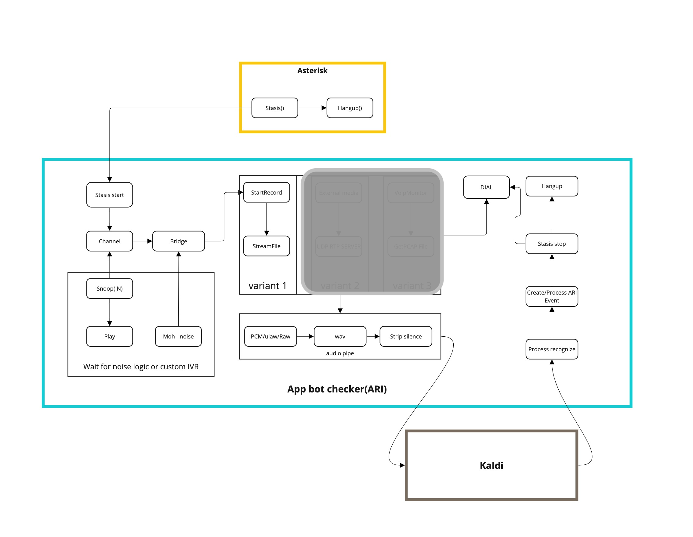

# asterisk-kaldi-bot-checker

## Эксперимент, проект рабочий и протестирован ТОЛЬКО на тестовой среде!!!

Распознавание автоответчиков с использованием технологии распознавания речи (STT) фреймворка Kaldi.
Данный проект интегрирован с Asterisk через интерфейсы ARI (Asterisk REST Interface) и AGI (Asterisk Gateway Interface).
Записи звонков получаются посредством WebSocket (WS) соединения с Asterisk.

В процессе обработки разговора используется промежуточный конвейер, состоящий из инструментов SOX и FFMPEG. 
Этот подход значительно снижает затраты и упрощает идентификацию ключевых фраз с помощью Kaldi, минимизируя при этом потребление ресурсов.
Определенные фразы сохраняются непосредственно в памяти приложения с использованием библиотеки hashicorp/go-memdb.
Кроме того, события отправляются в Kafka для дальнейшего хранения и естественно в метрики Prometheus.

Основные компоненты распознования и интеграции покрыты метриками и тестами.

Cм.: Makefile: lint_code_climate, test,  

## Contributions

Contributions to this repository are not accepted at the moment, as it is meant for personal use only.

## License

This repository and its packages are provided under the [MIT License](LICENSE). Feel free to modify and adapt the code for your personal use.
